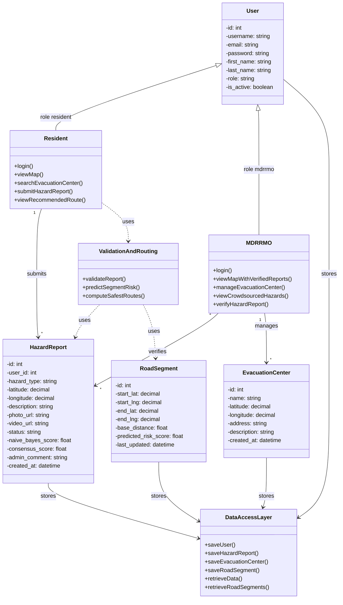
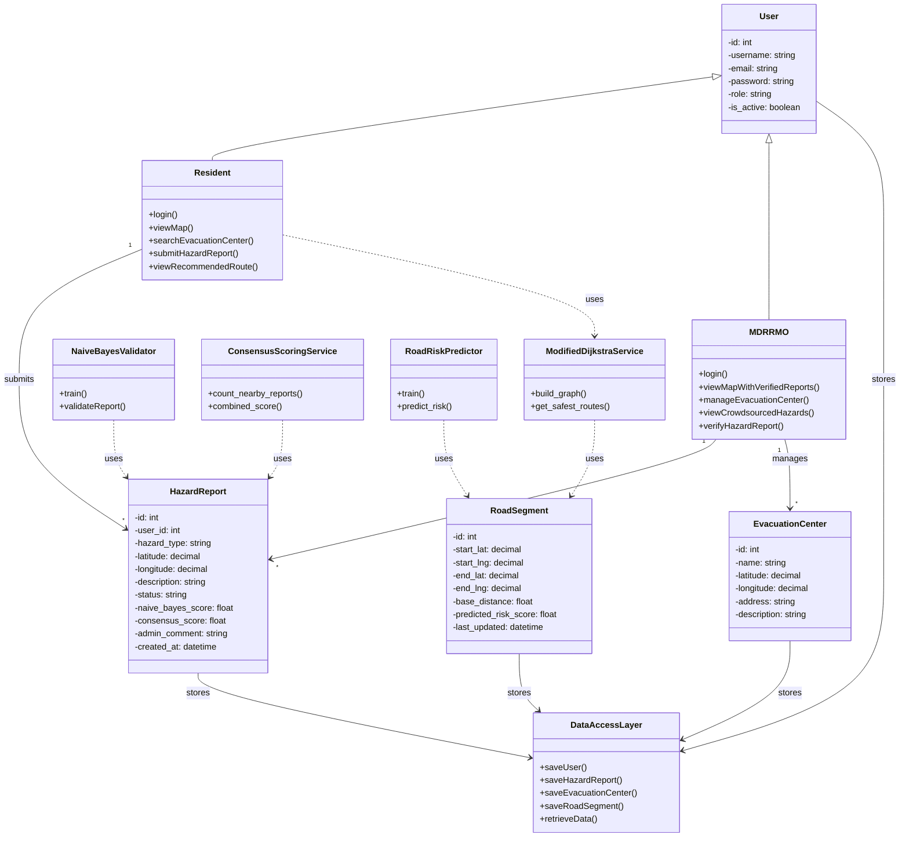

# Class Diagram (Mermaid) – Aligned with Current Implementation

Copy the code block below into [Mermaid Live Editor](https://mermaid.live) or any Markdown viewer that supports Mermaid.

---

## Alternative: Show four algorithm components separately

If you prefer to show Naive Bayes, Consensus, Random Forest, and Dijkstra as separate classes:

---

## Notes

- **User** is the single entity for both residents and MDRRMO; **Resident** and **MDRRMO** are roles (shown as subclasses with role-specific methods).
- **MDRRMO** does not submit hazard reports or get recommended routes; they verify reports and manage centers.
- **RoadSegment** replaces “Road” and uses `predicted_risk_score` (from Random Forest).
- **ValidationAndRouting** (first diagram) groups Naive Bayes, Consensus, Random Forest, and Dijkstra; the second diagram shows them as four classes.
